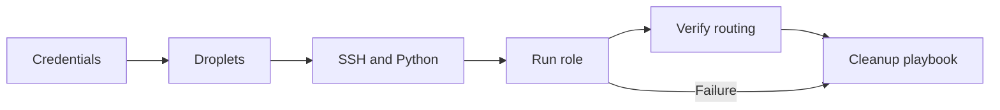
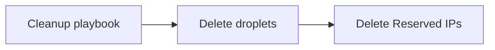

# Test Harness

This document describes the DigitalOcean Reserved IP role test harness. Local
test operations run through Workspace, which owns the repository Docker Compose
environment.

## Table of Contents

- [Coverage](#coverage)
- [Setup](#setup)
- [Workspace Commands](#workspace-commands)
- [DigitalOcean Live Tests](#digitalocean-live-tests)
- [Jenkinsfile Lint](#jenkinsfile-lint)
- [Clean Up](#clean-up)
- [Outbound Routing Verification](#outbound-routing-verification)
- [Notes](#notes)

## Coverage

The default inventory currently exercises:

| Family | Image slug |
| --- | --- |
| Debian | `debian-13-x64` |
| CentOS family | `centos-stream-10-x64` |
| Ubuntu | `ubuntu-24-04-x64` |

Single-family runs use the `debian`, `centos`, and `ubuntu` inventory groups
through Workspace's `WS_PLAYBOOK_LIMIT` wrapper around Ansible `--limit`.

## Setup

Install the Workspace CLI before running the test commands if `ws` is not
already available.

```bash
WS_VERSION=0.4.1
curl --output ./ws --location "https://github.com/my127/workspace/releases/download/${WS_VERSION}/ws"
chmod +x ws && sudo mv ws /usr/local/bin/ws
```

Workspace commands read local attributes from `workspace.override.yml`. Create
it from the example first:

```text
cp workspace.override.yml.example workspace.override.yml
```

Set the Workspace attributes needed for the commands you plan to run:

| Attribute | Used by | Purpose |
| --- | --- | --- |
| `test.digitalocean.api_token` | Live tests | DigitalOcean API token used to create and delete temporary Droplets and Reserved IPs. |
| `test.digitalocean.ssh_keys` | Live tests | DigitalOcean SSH key selectors to inject into temporary Droplets. |
| `test.digitalocean.project_name` | Live tests | Optional DigitalOcean project name for assigning temporary Droplets. |
| `ansible.galaxy.token` | Release commands | Ansible Galaxy API token used by token-required Galaxy checks, status, and import commands. |
| `github.api_token` | Release commands | GitHub API token used by GitHub release checks and publication commands. |

For example:

```ruby
attribute('test.digitalocean.api_token'): 'dop_v1_xxxxxxxxxxxxxxxxxxxxxxxxxxxxxxxx'
attribute('test.digitalocean.ssh_keys'): ['12345678']
attribute('test.digitalocean.project_name'): ''
attribute('ansible.galaxy.token'): 'your-galaxy-token'
attribute('github.api_token'): 'your-github-token'
```

Set `test.digitalocean.project_name` only when the temporary test Droplets
should be assigned to an existing DigitalOcean project.

For live tests, `test.digitalocean.api_token` and
`test.digitalocean.ssh_keys` are required. SSH key selectors can be IDs,
fingerprints, or names. In `workspace.override.yml`,
`test.digitalocean.ssh_keys` is a list. When passed through environment
variables or Jenkins credentials, multiple selectors can be comma or newline
separated. The selected DigitalOcean SSH keys must match private keys loaded in
the forwarded SSH agent. The harness validates that match before creating a
Droplet and uses the selected DigitalOcean public key to steer SSH agent
authentication.

For direct Ansible runs without Workspace, create the gitignored test variable
file instead:

```text
cp tests/test_variables.example.yml tests/test_variables.yml
```

```yaml
do_test_api_token: "dop_v1_xxxxxxxxxxxxxxxxxxxxxxxxxxxxxxxx"
do_ssh_keys:
  - "12345678"
# do_test_project_name: "existing-project-name"
```

To list available SSH key IDs and fingerprints with `doctl`:

```text
doctl compute ssh-key list --format ID,Name,FingerPrint
```

Load the matching private key into your SSH agent before running the playbooks:

```text
ssh-add ~/.ssh/<your-private-key>
```

The harness creates droplets with the `digitalocean.cloud` collection and
connects to them as `root`, so `do_ssh_keys` must reference a DigitalOcean SSH
key whose private key is available for root login.

If `DIGITAL_OCEAN_API_TOKEN` is exported in the current shell, it takes
precedence over `do_test_api_token` in `test_variables.yml`.
Likewise, `DIGITAL_OCEAN_SSH_KEYS` from Workspace, the shell, or Jenkins takes
precedence over `do_ssh_keys` in `test_variables.yml`.

## Workspace Commands

The preferred local entrypoint is Workspace:

```text
ws
```

Useful commands:

```text
ws ansible syntax
ws ansible lint
ws ansible playbook tests/playbook.yml tests/inventory
ws lint-jenkinsfile
ws test-live provision all
ws test-live cleanup all
ws test-live full-cycle all
ws test-live provision debian
ws test-live provision centos
ws test-live provision ubuntu
```

Both `ws console` and `ws ansible playbook` load live-test environment values
from `workspace.override.yml` and forward them into the `console` container.
The live playbooks also load `tests/test_variables.yml` directly, so manual
Workspace playbook runs and intentional raw Ansible runs both use test
variables.

Use `ws console` with no argument for an interactive shell when a command needs
shell quoting. The non-interactive `ws console <command>` form is intentionally
limited to simple whitespace-separated commands used by Workspace helpers.

Use `ws ansible syntax` for syntax checks and `ws ansible lint` for role linting.

## DigitalOcean Live Tests

The live-test command has three explicit phases:

```text
ws test-live provision all
ws test-live cleanup all
ws test-live full-cycle all
```

`provision` creates the temporary Droplets, installs Python, applies the
Reserved IP role, verifies the Reserved IP and outbound routing state, and
leaves the billable resources running for manual inspection.

`cleanup` removes Reserved IPs associated with matching test Droplets and then
deletes the Droplets. It is idempotent and can be run after an interrupted or
already-cleaned test.

`full-cycle` is the CI-safe path. It runs `provision`, then always runs
`cleanup`, including when provisioning or validation fails.

Run one family only:

```text
ws test-live full-cycle debian
ws test-live full-cycle centos
ws test-live full-cycle ubuntu
```

For manual playbook runs, use the Workspace wrapper from the repository root:

```text
ws ansible playbook tests/playbook.yml tests/inventory
```

Run one family only:

```text
WS_PLAYBOOK_LIMIT=debian ws ansible playbook tests/playbook.yml tests/inventory
WS_PLAYBOOK_LIMIT=centos ws ansible playbook tests/playbook.yml tests/inventory
WS_PLAYBOOK_LIMIT=ubuntu ws ansible playbook tests/playbook.yml tests/inventory
```

`tests/inventory` disables local SSH proxy configuration for the temporary
DigitalOcean droplets so the live test connects directly to the provisioned
hosts.

The live playbook:

- creates one small DigitalOcean droplet for each target OS
- waits for SSH
- installs Python if the image needs it
- allocates or attaches the Reserved IP
- validates SSH agent access with the selected DigitalOcean SSH key
- verifies outbound routing through the Reserved IP

The `full-cycle` path creates real provider resources, validates them, and then
hands off to the cleanup playbook whether validation succeeds or fails. The
`provision` path stops after validation so operators can inspect the resources
before running `cleanup`.

The provisioning phase creates the temporary Droplets, prepares SSH access,
runs the role, validates routing, and then hands the full-cycle path to cleanup.



The cleanup phase starts from the same handoff node and removes the temporary
DigitalOcean resources.



## Jenkinsfile Lint

Validate the repository `Jenkinsfile` with the Workspace Jenkins lint controller
and the Jenkins Declarative Pipeline linter:

```text
ws lint-jenkinsfile
```

This command starts the Workspace `console` and `jenkins-lint` Compose services
and runs the helper inside the `console` container.

## Clean Up

If a live run is interrupted, or after a manual `provision` inspection, destroy
all test Droplets and Reserved IPs with Workspace:

```text
ws test-live cleanup all
```

Clean up one family only:

```text
ws test-live cleanup debian
ws test-live cleanup centos
ws test-live cleanup ubuntu
```

To run only the cleanup playbook through Workspace:

```text
ws ansible playbook tests/playbook_cleanup.yml tests/inventory
```

If a single-family run fails mid-flight, clean up with the matching limit
before retrying:

```text
WS_PLAYBOOK_LIMIT=debian ws ansible playbook \
  tests/playbook_cleanup.yml tests/inventory
```

## Outbound Routing Verification

The test playbooks verify that outbound routing through the Reserved IP is
working correctly by querying `https://icanhazip.com/` and asserting that the
returned outbound IP matches the assigned Reserved IP address.

During the SSH handoff, the role switches Ansible management to the Reserved IP
before the route cutover and uses a per-host temporary `known_hosts` file on
the control machine so parallel matrix runs do not race on shared host-key
state.

On CentOS-family test droplets, the role may reboot once after updating the
active NetworkManager connection with `nmcli connection modify ...
ipv4.gateway ...` so the persisted gateway change is applied cleanly.

If routing verification fails:

1. Check that the droplet has network connectivity.
2. Verify DNS resolution is working on the droplet.
3. Confirm that the anchor gateway metadata was retrieved correctly.
4. Check the droplet's routing table: `ip route show`.
5. On the droplet, manually test the Reserved IP endpoint:
   `curl -4 https://icanhazip.com/`.

To skip routing configuration, add
`digitalocean_reserved_ip_enable_outbound_routing: false` to the playbook
variables.

## Notes

- The harness provisions real droplets and Reserved IPs, so it incurs cost.
- No AWS credentials are required; only DigitalOcean credentials are used.
- The harness connects to test droplets as `root`.
- `workspace.override.yml` and `tests/test_variables.yml` must stay untracked
  because they may contain local credentials.
- Live-test droplets are assigned to the DigitalOcean project configured by
  `test.digitalocean.project_name` in `workspace.override.yml`, or by
  `do_test_project_name` in `tests/test_variables.yml` for direct Ansible runs.
- Test droplets are named `ansible-digitalocean-reserved-ip-<inventory-name>`
  and tagged with `ANSIBLE-TEST` for cleanup.
- Cleanup also recognises the previous `<inventory-name>-test-with-ansible`
  droplet names so interrupted older test runs can be removed.
- If a test run fails mid-flight, run the cleanup playbook before starting the
  next run.
- If you get `Permission denied (publickey)`, confirm the private key matching
  `do_ssh_keys` is loaded in your SSH agent.
- If you get a `401 Unauthorized` error, verify `do_test_api_token` in
  `test_variables.yml` or export a valid `DIGITAL_OCEAN_API_TOKEN`. The harness
  checks `/v2/account` before provisioning, so an invalid token fails early
  with a clear authentication message.
